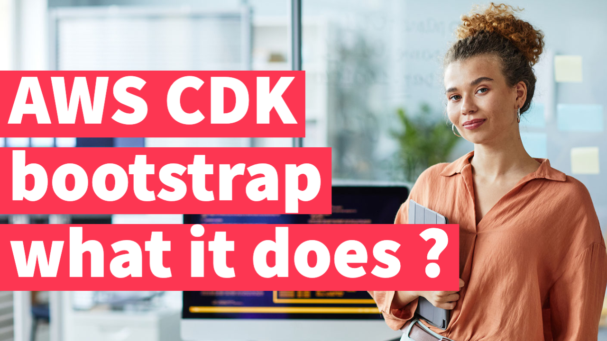

# Build alarms for cloudfront errors AWS CDK Part-14

| Part    | Link                                                                                 |
| ------- | ------------------------------------------------------------------------------------ |
| Part-0  | https://code.tkssharma.com/aws-cdk-for-deploying-aws-resources-blogs-series               |
| Part-1  | https://code.tkssharma.com/build-and-deploy-application-using-aws-cdk-part-1              |
| Part-2  | https://code.tkssharma.com/build-and-deploy-application-using-aws-cdk-part-2              |
| Part-3  | https://code.tkssharma.com/deploy-api-gateway-using-aws-cdk-part-3                        |
| Part-4  | https://code.tkssharma.com/deploy-lambda-with-s3-dynamo-and-api-gateway-cdk-part-4        |
| Part-5  | https://code.tkssharma.com/deploy-proxy-api-gateway-and-rest-apis-cdk-part-5              |
| Part-6  | https://code.tkssharma.com/deploy-proxy-api-gateway-and-rest-apis-cdk-part-6              |
| Part-7  | https://code.tkssharma.com/deploy-api-gateway-with-lambda-and-authorizer-part-7           |
| Part-8  | https://code.tkssharma.com/deploying-ec2-instance-nested-stack-using-aws-cdk-part-8       |
| Part-9  | https://code.tkssharma.com/deploying-rds-database-stack-using-aws-cdk-part-9              |
| Part-10 | https://code.tkssharma.com/deploying-sns-sqs-using-aws-cdk-part-10                        |
| Part-11 | https://code.tkssharma.com/building-lambda-trigger-with-sns-sqs-s3-using-aws-cdk-part-11  |
| Part-12 | https://code.tkssharma.com/building-cloudwatch-alarm-for-lambda-part-12                   |
| Part-13 | https://code.tkssharma.com/building-cloudwatch-notification-for-lambda-log-errors-part-13 |  |



In this Blog we will talk about adding alarms for CDN Failure on Cloudfront

The AWS CDK (Cloud Development Kit) is a framework that allows developers to define cloud infrastructure resources using familiar programming languages such as TypeScript, Python, or Java. The `cdk synth` command is a command-line tool provided by the AWS CDK that synthesizes the infrastructure stack defined in your code into an AWS CloudFormation template.

When you run `cdk synth`, it reads the code written in your preferred programming language and generates a CloudFormation template as output. This template describes the AWS resources and configurations that are required to deploy your infrastructure. The generated template can then be deployed using the AWS CloudFormation service.

The `cdk synth` command is typically used as part of the development workflow to preview and validate the infrastructure stack before deploying it. It allows you to check for any potential issues or misconfigurations in your code and ensures that the generated CloudFormation template accurately represents your desired infrastructure.

In summary, `cdk synth` is a command that converts your AWS CDK code into a CloudFormation template, which can be used to deploy your infrastructure on AWS.


The `cdk bootstrap` command is used in the AWS CDK (Cloud Development Kit) to set up the necessary resources in your AWS account to deploy CDK applications. It prepares your AWS environment to support the deployment of CDK stacks.

When you run `cdk bootstrap`, it performs the following tasks:

1. Creates an Amazon S3 bucket: The command creates an S3 bucket in your AWS account that is used to store the CloudFormation templates and assets associated with your CDK application.

2. Sets up an AWS CloudFormation stack: It deploys a CloudFormation stack that contains the necessary resources to enable the CDK deployment process. This stack includes an AWS Identity and Access Management (IAM) role and an Amazon S3 bucket policy.

3. Configures the CDK toolkit: The `cdk bootstrap` command also configures the CDK toolkit, which is a set of tools and services that support the deployment and management of CDK applications. It ensures that the CDK toolkit is properly set up to communicate with the AWS environment.

By running `cdk bootstrap` once in your AWS account, you set up the foundational resources required for deploying CDK applications. This command needs to be executed only once, unless you want to update the configuration or change the resources associated with your CDK deployment.

In summary, `cdk bootstrap` is used to prepare your AWS environment by creating necessary resources, such as an S3 bucket and CloudFormation stack, to enable the deployment of CDK applications and configure the CDK toolkit.

CDK bootstrap is a command we can access using the CDK CLI.
```sh
npx aws-cdk bootstrap
```

The cdk bootstrap command provisions a CloudFormation stack called CDKToolkit. This CloudFormation stack is specific to the environment (region and account) our CDK stack is configured for.

Every CDK application belongs to a specific environment.

An environment consists of an account number and a region, where the CDK app is going to be deployed.

We set the environment for a CDK project when instantiating a CDK stack:
```js
const app = new cdk.App();

const myStack = new MyCdkStack(app, 'my-cdk-stack', {
  stackName: `my-cdk-stack`,
  // 👇 set the environment
  env: {
    region: process.env.CDK_DEFAULT_REGION,
    account: process.env.CDK_DEFAULT_ACCOUNT,
  },
});
```
The initialization process of the environment consists of:

- provisioning an S3 bucket, where our assets (i.e. Lambda function code, CloudFormation template) will be stored
- provisioning IAM roles the CDK CLI needs in order to perform a deployment in the environment In order to deploy to multiple environments we have to bootstrap each environment.
- The CDKToolkit stack provisions an S3 bucket that stores the assets(i.e. Lambda code, CloudFormation template, etc), required for a CDK deployment.


In order to bootstrap our default account and region we can run the cdk bootstrap command.

```sh
npx aws-cdk bootstrap
```

We only need to use the bootstrap command once for every environment(region and account).

If we use the command more than once, the CDK CLI will check if our CDKToolkit stack has to be updated. If necessary, the stack will be updated. If not, running the bootstrap command does nothing.

We can also specify other environments to bootstrap:

```sh
npx aws-cdk bootstrap --profile my-profile

npx aws-cdk bootstrap ACCOUNT_NUMBER/REGION

npx aws-cdk bootstrap 123456789/us-east-1
```


### Here are some commonly used AWS CDK (Cloud Development Kit) commands:

1. `cdk init`: Initializes a new CDK project in the current directory, setting up the project structure and essential files.

2. `cdk synth`: Synthesizes the CDK app into an AWS CloudFormation template, generating the infrastructure stack's definition in YAML or JSON format.

3. `cdk deploy`: Deploys the CDK app by creating or updating the specified stack in your AWS account. It provisions the defined infrastructure resources.

4. `cdk destroy`: Tears down the CDK stack and deletes the associated resources provisioned in your AWS account.

5. `cdk list`: Lists all the available stacks in the CDK app.

6. `cdk diff`: Compares the current state of the deployed stack with the desired state defined in your CDK app, showing the differences in infrastructure configuration.

7. `cdk bootstrap`: Prepares your AWS account for CDK deployments by creating the necessary resources, such as an S3 bucket and CloudFormation stack.

8. `cdk doctor`: Checks the local environment for any potential configuration issues or missing dependencies related to the CDK.

9. `cdk metadata`: Retrieves metadata information about the deployed stack, such as stack outputs and resources.

These are just a few examples of commonly used CDK commands. The AWS CDK provides additional commands and options to facilitate working with CDK applications. You can explore the official AWS CDK documentation for more details on available commands and their usage.

CDK Constructs are reusable building blocks in the AWS CDK (Cloud Development Kit) framework. They represent AWS resources or sets of resources that can be composed together to define your cloud infrastructure in a programmatic and modular way. Constructs encapsulate the configuration and behavior of AWS resources, allowing you to define and manage your infrastructure at a higher level of abstraction.

### Constructs provide several benefits:

1. **Abstraction**: Constructs abstract the low-level details of AWS resource provisioning and configuration, enabling you to focus on the higher-level architecture and logic of your application.

2. **Modularity**: Constructs promote code reusability by encapsulating common patterns or sets of resources that can be shared across different projects. They can be easily composed and combined to create complex architectures.

3. **Consistency**: Constructs provide a consistent and predictable way to define and manage your infrastructure. They enforce best practices and help maintain consistency across different environments.

4. **Ease of use**: Constructs are designed to be developer-friendly, allowing you to define infrastructure using familiar programming languages such as TypeScript, Python, or Java. This makes it easier to leverage your existing development skills and tools.

AWS CDK includes a wide range of pre-built Constructs that represent various AWS resources, such as Amazon S3 buckets, Amazon EC2 instances, AWS Lambda functions, Amazon DynamoDB tables, and many more. Additionally, you can create your own custom Constructs to encapsulate reusable patterns or abstract complex configurations specific to your application.

By leveraging CDK Constructs, you can define and manage your cloud infrastructure as code, with the ability to easily reuse, share, and evolve your infrastructure components. This approach brings flexibility, scalability, and maintainability to your infrastructure-as-code projects.


### Here are some examples of CDK Constructs available in the AWS CDK:

1. **aws-s3**: Represents an Amazon S3 bucket and provides configuration options for properties like bucket name, encryption, access control, and event notifications.

2. **aws-ec2**: Defines an Amazon EC2 instance and allows you to configure properties such as instance type, AMI ID, security groups, and key pairs.

3. **aws-lambda**: Represents an AWS Lambda function and provides options for specifying the function code, runtime, memory allocation, environment variables, and event triggers.

4. **aws-dynamodb**: Defines an Amazon DynamoDB table and allows you to configure properties such as table name, primary key schema, provisioned throughput, and global secondary indexes.

5. **aws-apigateway**: Represents an Amazon API Gateway REST API and provides options for defining API endpoints, methods, request/response models, authentication, and authorization.

6. **aws-iam**: Provides constructs for managing AWS Identity and Access Management (IAM) resources, such as roles, policies, users, groups, and permissions.

7. **aws-events**: Allows you to define AWS CloudWatch Events rules, which enable event-driven architectures by specifying event patterns and target actions.

8. **aws-sqs**: Represents an Amazon Simple Queue Service (SQS) queue and provides options for configuring queue properties, access policies, and message retention.

9. **aws-cloudfront**: Defines an Amazon CloudFront distribution and allows you to configure properties like origin server, caching behavior, SSL certificates, and access control.

These are just a few examples of the CDK Constructs available. The AWS CDK offers a wide range of Constructs for different AWS services, and you can find additional Constructs and their documentation in the official AWS Construct Library. Additionally, you can create your own custom Constructs to encapsulate reusable patterns or abstract complex configurations specific to your application's needs.

Here are a few code examples showcasing the usage of CDK Constructs in different programming languages:

**TypeScript:**

```typescript
import * as cdk from 'aws-cdk-lib';
import * as s3 from 'aws-cdk-lib/aws-s3';

const app = new cdk.App();
const stack = new cdk.Stack(app, 'MyStack');

// Creating an S3 bucket construct
new s3.Bucket(stack, 'MyBucket', {
  bucketName: 'my-bucket',
  removalPolicy: cdk.RemovalPolicy.DESTROY,
});
```

**Python:**

```python
from aws_cdk import core
from aws_cdk import aws_s3 as s3

app = core.App()
stack = core.Stack(app, 'MyStack')

# Creating an S3 bucket construct
s3.Bucket(stack, 'MyBucket', bucket_name='my-bucket', removal_policy=core.RemovalPolicy.DESTROY)

app.synth()
```

**Java:**

```java
import software.amazon.awscdk.core.App;
import software.amazon.awscdk.core.Stack;
import software.amazon.awscdk.services.s3.Bucket;

public class MyStackApp {
  public static void main(String[] args) {
    App app = new App();
    Stack stack = new Stack(app, "MyStack");

    // Creating an S3 bucket construct
    new Bucket(stack, "MyBucket")
        .setBucketName("my-bucket")
        .setRemovalPolicy(RemovalPolicy.DESTROY);

    app.synth();
  }
}
```

In these examples, we import the necessary CDK modules for the desired AWS service, such as `aws-s3` for Amazon S3. We then create an instance of the respective Construct and configure its properties. Finally, we call `app.synth()` or `app.synthesize()` to generate the CloudFormation template for deployment.

These examples demonstrate the basic usage of CDK Constructs. You can explore the AWS CDK documentation and the respective programming language-specific CDK libraries for more details and advanced usage examples of specific Constructs and their properties.